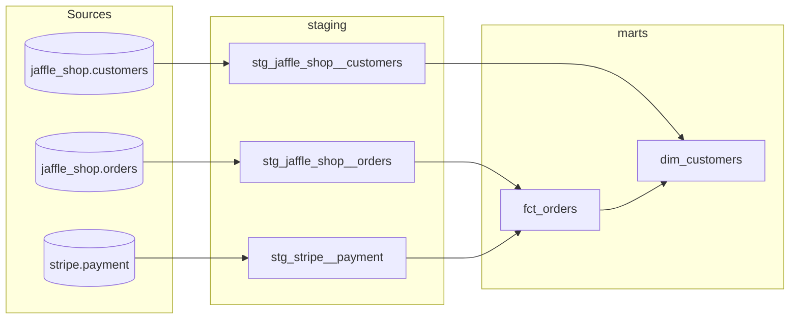

# dbt Fundamentals — jaffle_shop analytics

A dbt project modeling the classic `jaffle_shop` (orders/customers) and `stripe`
(payments) source data into query-ready finance and marketing marts, on
BigQuery.

## Architecture



| Layer | Materialization | Purpose |
|---|---|---|
| `models/staging/` | view | 1:1 with sources — rename/cast columns only, no business logic |
| `models/marts/finance/fct_orders` | table | one row per order, with successful payment total |
| `models/marts/marketing/dim_customers` | table | one row per customer, with lifetime order aggregates |
| `snapshots/orders_snapshot` | snapshot | type-2 history of order `status` over time |
| `seeds/order_status_descriptions` | seed | lookup table mapping raw status codes to readable labels |

**BigQuery Sandbox note:** this GCP project has no billing account attached,
so BigQuery runs in Sandbox mode, which blocks DML (`MERGE`/`UPDATE`/
`INSERT`). That ruled out an incremental `fct_orders` (its merge-on-`order_id`
logic is DML) — it's a plain `table` rebuilt in full every run instead.
Snapshots inherently rely on `MERGE` to record changes, so `orders_snapshot`
needs `dbt run-operation reset_snapshot` run first (see below) — that drops
the table so the next `dbt snapshot` does a fresh `CREATE TABLE` instead of a
blocked `MERGE`. The tradeoff: no real history accumulates across runs while
billing stays off, since each run replaces the table rather than appending
to it. Enable billing on the project to remove all of this and get real
incremental/snapshot behavior — BigQuery's free tier (1TB queries/month)
still applies.

Stripe amounts arrive in cents; `stg_stripe__payment` converts them to dollars
via the `cents_to_dollars` macro (`macros/cents_to_dollars.sql`), so every
downstream model works in dollars.

## Setup

1. Install dependencies (a virtualenv is recommended so this doesn't collide
   with other dbt projects on your machine):
   ```
   pip install -r requirements.txt
   ```
2. Authenticate to BigQuery for local/interactive use:
   ```
   gcloud auth application-default login
   ```
   (opens a browser — sign in with the Google account tied to your GCP
   project)
3. Copy `profiles.yml.example` to `~/.dbt/profiles.yml` (or point
   `DBT_PROFILES_DIR` at a folder containing it), set `project` to **your
   own** GCP project ID (not `dbt-tutorial` — that's dbt Labs' project; you
   need somewhere of your own for dbt to create output datasets and for
   BigQuery to bill the jobs against), and set `dataset` to a schema name
   you want dbt to create there.
4. Install packages and build:
   ```
   dbt deps
   dbt run-operation reset_snapshot
   dbt build
   ```
   The `reset_snapshot` step is only needed because this project runs in
   BigQuery Sandbox mode — see the note above. Skip it once billing is
   enabled on the project.

## Everyday commands

| Command | What it does |
|---|---|
| `dbt run-operation reset_snapshot && dbt build` | the full build, safe to re-run any time (Sandbox mode) |
| `dbt run` | build models only |
| `dbt test` | run schema + singular tests only |
| `dbt seed` | load `seeds/order_status_descriptions.csv` |
| `dbt run-operation reset_snapshot && dbt snapshot` | rebuild `orders_snapshot` (Sandbox mode) |
| `dbt docs generate && dbt docs serve` | build and browse the docs site / DAG |
| `sqlfluff lint models` | lint SQL style (matches CI) |

## Testing strategy

- **Sources**: primary keys are `unique` + `not_null` on every raw table.
- **Staging**: primary keys re-checked after renaming; `stg_stripe__payment`
  additionally checks `payment_status` against known values and enforces
  referential integrity to `stg_jaffle_shop__orders`.
- **Marts**: primary keys, not-null business columns, and a `relationships`
  test tying `fct_orders.customer_id` back to `stg_jaffle_shop__customers`.
- **Singular test**: `tests/assert_stg_stripe___payments_total_positive.sql`
  guards against negative payment totals per order.
- Every model and source column has a `description`, so `dbt docs generate`
  produces a fully documented site — no orphan tables.

## CI

`.github/workflows/dbt_ci.yml` has two jobs:

- **`checks`** — runs on every push/PR, no secrets needed. `dbt parse`
  doesn't open a warehouse connection, so it still catches broken
  `ref`/`source` calls, invalid YAML, and Jinja errors for free.
- **`lint_and_build`** — `sqlfluff lint` (its dbt templater needs a live
  connection to build a relations cache), `dbt run-operation reset_snapshot`
  (see the Sandbox mode note above), then `dbt build` against BigQuery.
  Gated behind the `BIGQUERY_CI_ENABLED` repository variable (already set to
  `true`) and the `BIGQUERY_KEYFILE_JSON` repository secret — a key for the
  `dbt-service` service account in the `wide-isotope-409918` project, scoped
  to just `roles/bigquery.dataEditor` + `roles/bigquery.jobUser` (not
  `roles/owner`, which it started with).

## Analyses

`analyses/` holds ad-hoc SQL compiled by `dbt compile` but never built by
`dbt run`/`dbt build` — e.g. `customer_lifetime_value_ranking.sql` and
`orders_by_status.sql`.
